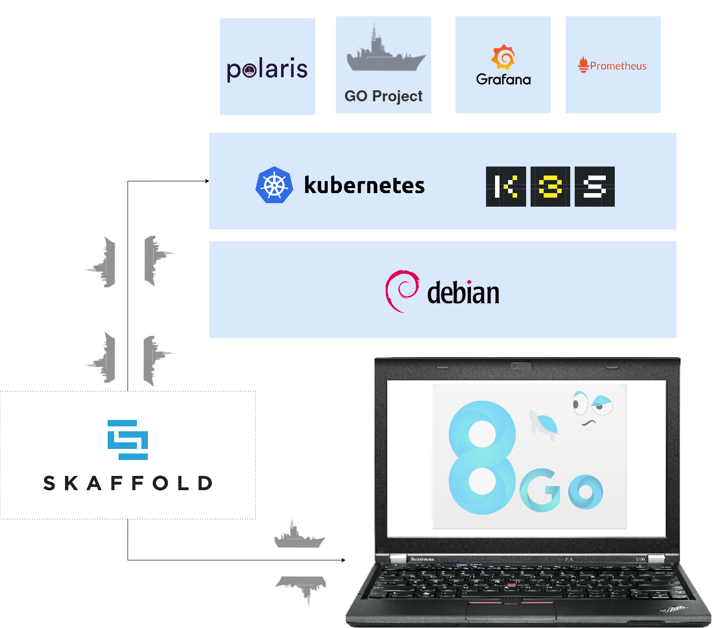

### k-native tutorial 
In this tutorial i will demonstrate how you can turn your personal computer into a production grade environment for live k-native development.

link to tutorial [here](https://kyouuma.blogspot.com/2020/03/its-corona-season-and-im-sitting-in-my.html)

        Introduction
        Installing the underlying OS.
        Reducing OS footprint.
        Installing k3s.
        post installation hacks [ Private DNS Resolution,..].
        Installing Prometheus & Grafana
        Installing Polaris
        Installing Skaffold
        Live development on kubernetes
        Beyond μDC, Embracing gitOps [Insight].
